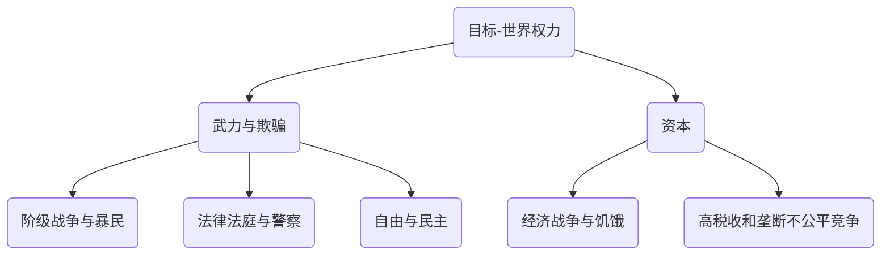
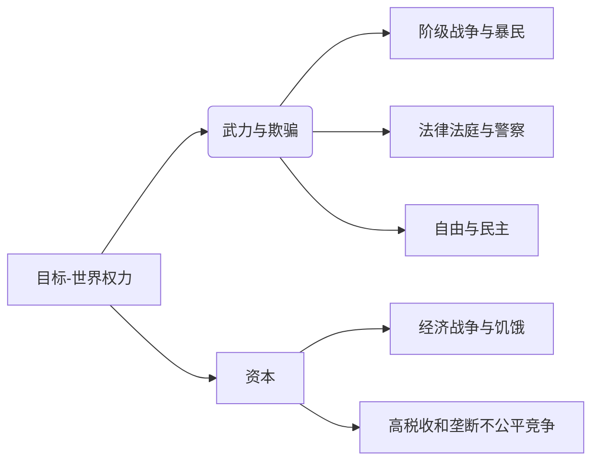

[锡安长老会纪要](https://wenku.baidu.com/view/242307cc06a1b0717fd5360cba1aa81145318f53.html)

## 犹太人统治世界的25点计划
1. 应用暴力和恐怖手段，而不是不切实际的辩论方式
2. 宣扬“自由主义”，来篡夺政治权力
3. 发动阶级战争
4. 政治家必须伪善和狡诈，遵守过多的规则会使政治家易受伤害
5. 取消现有的命令和管理机构——颠覆现有政权，重建全部现存机构
6. 躲在暗处，直到它获得——没有任何欺诈和势力能够损害它的实力之时
7. 应用暴民心理学去控制大众，“没有绝对的独裁，一个人将不能有效地进行统治”
8. 提倡应用酒精、药物、道德堕落、及罪恶的各种形式，通过代理人来有系统的腐蚀青年
9. 无论如何要抓住有用的道具以获取服从和主权
10. 煽动战争和控制和平谈判，以便参战者都不能获取领土，将他们置于更深的债务——因此落入我们的掌握之中
11. 选择“对我们的要求奴颜和顺从的”公职候选人，他们作为我们的游戏中的棋子或许会被迅速使用
12. 利用新闻媒体的宣传，控制全部公众信息的发布，而我们则躲在幕后，远离批评
13. 使群众相信他们已经成为犯罪的牺牲品，然后我们以救世主的面目出现，并重新恢复秩序
14. 制造金融恐慌，利用饥饿去控制和征服大众
15. 利用共济会的大东方分会渗透共济会，利用慈善事业掩盖我们的工作的真正目的。在异邦人（异教徒）中间散步无神论——唯物主义世界观
16. 当我们的握有至高无上权力的世界君主加冕的那一时刻来临时，他们的权势将会粉碎挡在他们前面的任何障碍
17. 利用系统的欺骗，冠冕堂皇的词语和流行的口号。 “在后来都可以把已经许下的诺言推翻，这是没有任何风险的。”
18. 恐怖统治是实现迅速服从的最经济有效的方法
19. 应用手腕伪装成政治、金融、经济顾问，以实现我们的代理统治，从而不用害怕“躲在政府和世界事务背后的神秘力量”的暴露
20. 最终的世界政府是我们奋斗的目标。这就有必要建立起空前的垄断，因此甚至异教徒的巨量财富也要依赖我们到这种程度——他们会和他们的因巨大的政治动荡而破产的政府信用一起被踩在最底层
21. 采用经济战，掠夺异教徒的土地财富，应用高税收和不公平竞争的联合方式掠夺异教徒的工业
22. 使异教徒彼此消灭对方，从而使世界上只剩下最下层阶级、极少数奉献于我们事业的富翁、和足够的用以保护我们利益的警察和士兵
23. 我们把它称作新秩序，并委任一个独裁者
24. 通过教授我们知道是错误的理论和观念，来欺骗、迷惑和腐蚀社会的年轻成员
25. 扭曲国内法和国际法，使之互相矛盾——首先掩饰法律，之后将法律全部掩藏。（用我们的意志）取代法律的仲裁

